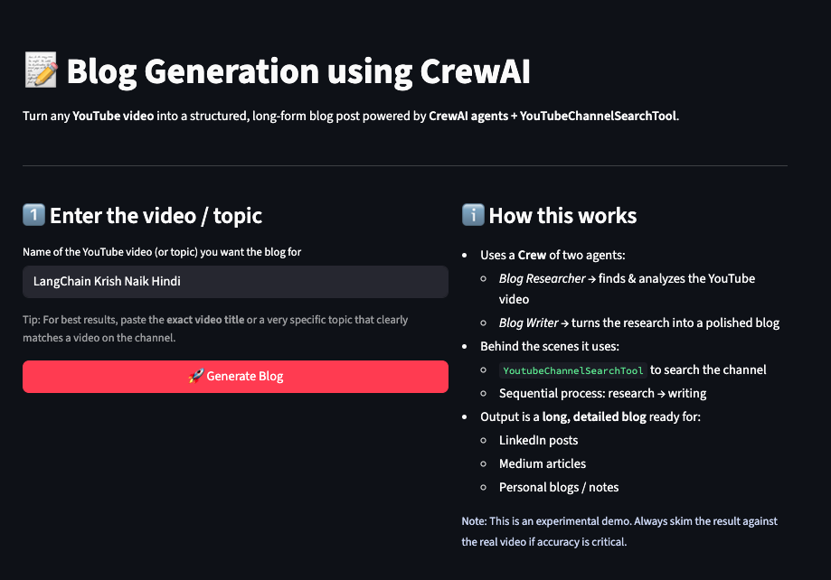
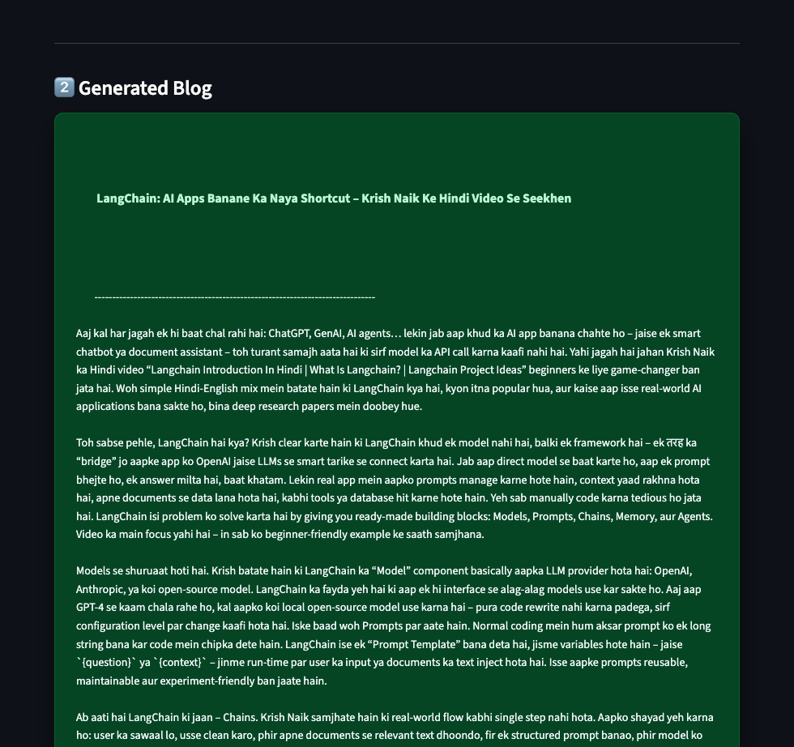

# **📝 VidBlog-AI:YouTube-to-Blog Generator using CrewAI**

Transform any YouTube video into a well-structured, long-form blog post using the power of CrewAI agents, YouTubeChannelSearchTool, and Streamlit.
This project automates the full workflow:
- Find the video
- Extract key insights
- Write a polished blog

Perfect for content creators, educators, students, SEO bloggers, and anyone who wants fast, high-quality written content from video sources.

---

## 🖼️ Application Preview

#### Home Screen
 

#### Summary Output
 


---

## 🚀 Features

- 🔍 Automated YouTube Research
  - Uses YoutubeChannelSearchTool (CrewAI Tools) to locate and analyze relevant videos from the target channel.
    

- 🧠 Dual-Agent Architecture (CrewAI)
  - Blog Researcher Agent → Extracts insights, structure, summary
  - Blog Writer Agent → Converts raw research into a polished, publication-ready blog


- 🧩 Sequential Task Pipeline
  - CrewAI orchestrates the entire process:
    Research → Understanding → Writing → Final Blog

- 🖥️ Production-Styled Streamlit UI
  - Designed for clean usability:
    - Dark theme
    - Highlighted blog card
    - Download button
    - Full responsiveness
    - Professional layout

- 📥 Download-Ready Blog Output
  - Users can export the generated blog as .txt.
 

--- 

## 📌 Tech Stack

| Component      | Technology                                    |
| -------------- | --------------------------------------------- |
| AI Framework   | CrewAI                                        |
| Agents         | Blog Researcher, Blog Writer                  |
| Tools          | YouTubeChannelSearchTool                      |
| UI             | Streamlit                                     |
| Language       | Python                                        |
| Model Provider | OpenAI / Groq / LLM configured in environment |
| Deployment     | Local Streamlit or Cloud                      |


---


## 📂 Project Structure

```bash
VidBlog-AI/
│
├── agents.py              # CrewAI agents (Researcher, Writer)
├── tasks.py               # Research + Writing tasks
├── tools.py               # YouTube tool configuration
├── crew.py                # Streamlit production-style UI
├── README.md
└── requirements.txt
```

## 👤 Author

Pahuldeep Singh Dhingra  
Master’s Student – Data Science & Analytics  
FAU, USA  
[LinkedIn](https://www.linkedin.com/in/pahuldeepsing/)  
[email](pahuldeepsingh531@gmail.com)


